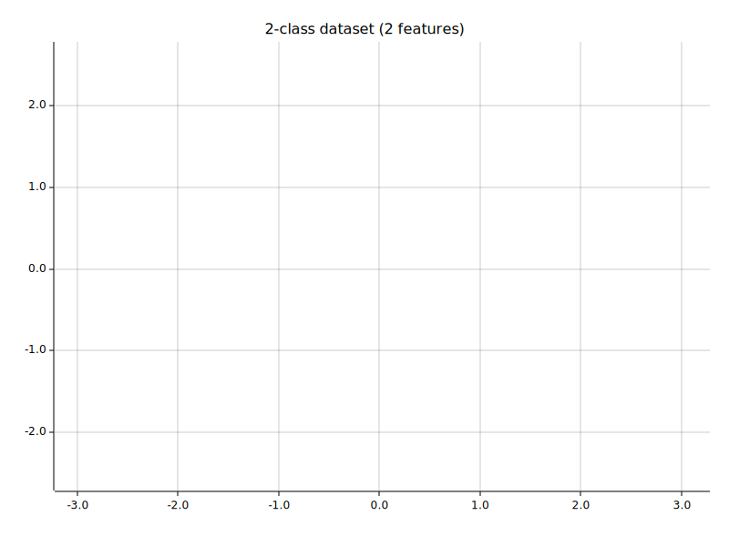

# GradFlow

A tiny autodifferentiation engine with a PyTorch-like API for building neural networks.

## Examples

### Blob binary classification

Run: ```cargo run --example blobs_binary_classification```



### Spiral binary classification

Run: ```cargo run --example spiral_binary_classification```

