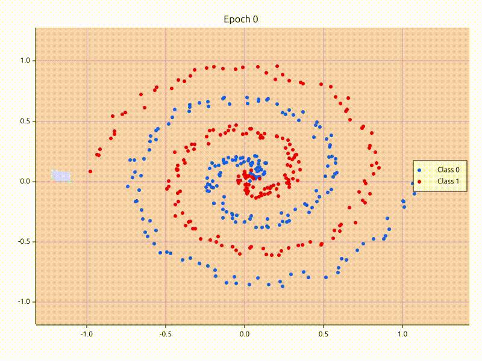

# GradFlow

A tiny autodifferentiation engine with a PyTorch-like API for building neural networks in Rust.

## Examples

### Blob binary classification

Run: ```cargo run --example blobs_binary_classification```


### Spiral binary classification

Run: ```cargo run --example spiral_binary_classification```


#### Animation

An animation can even be created to show how the decision regions change epoch by epoch! Here is an example:



Add this code in the training loop to generate a decision region SVG for each epoch:

```
let frame_name = format!("data/example_spiral_frames/frame_{}.svg", epoch);
let caption = format!("Epoch {}", epoch);
plot_decision_regions(&points, &frame_name, &model, Some(&caption)).expect("Couldn't plot decision regions");
```

Convert SVGs into PNGs (code for Debian)

```
sudo apt install librsvg2-bin

for f in frame_*.svg; do
    rsvg-convert "$f" -o "${f%.svg}.png"
done
```

Use FFmpeg to merge all the PNG frames into an MP4 video:

```
ffmpeg -framerate 30 -i frame_%04d.png -pix_fmt yuv420p output.mp4
```